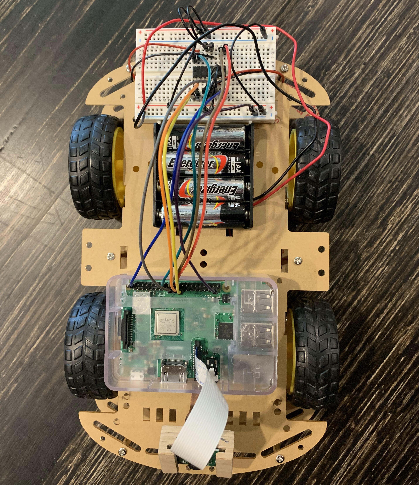
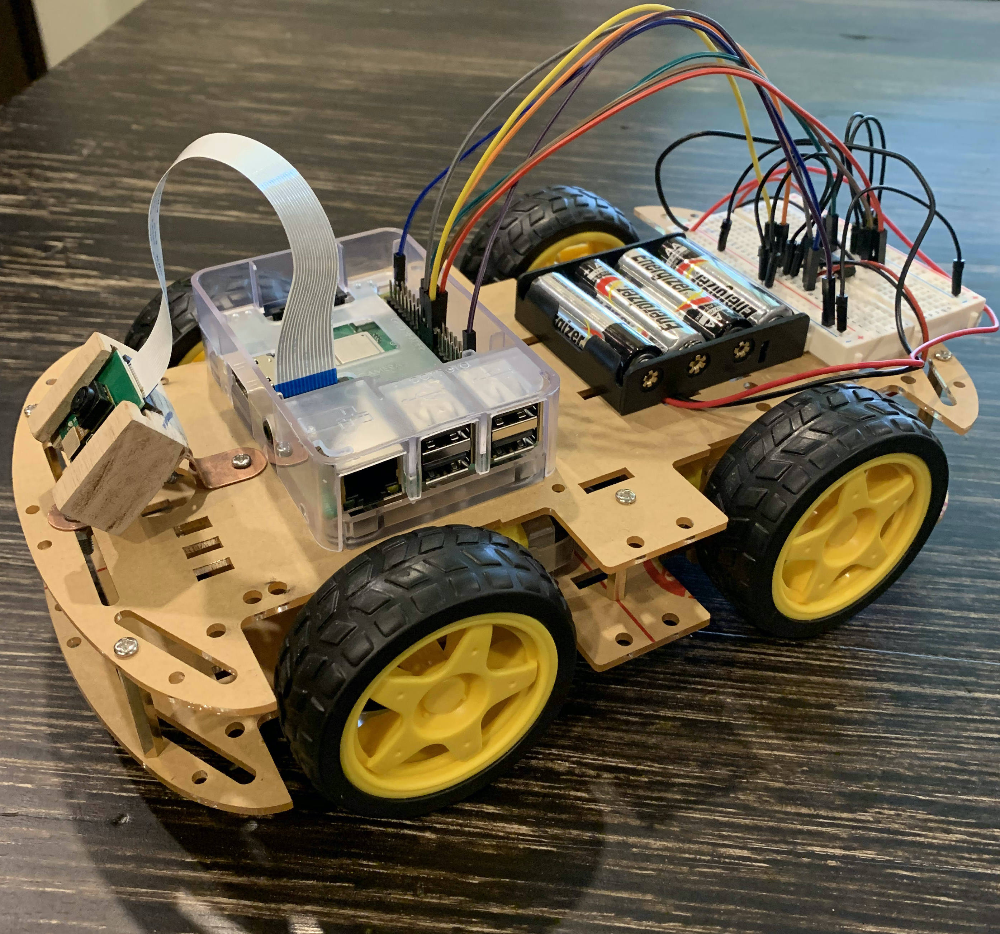

<h1>Autonomous Mini Cart</h1>

The Mini Cart is designed to follow directions without pre-programmed instructions.
The end user can simply point in the desired direction of travel and the robot will
react accordingly. Computer vision and Machine Learning are used to determine
intended commands from instructor.

<h3>Raspberry Pi</h3>

The Mini Cart is powered by a
<a href = "https://www.raspberrypi.org/" target = "_blank" style = "color: black">Raspberry Pi</a>; the Pi is
responsible for all ML computations, capturing pictures via the Pi camera, and reacting
by powering servo motors with GPIO (General Purpose Input Output) pins. A Python
<a href = "https://virtualenv.pypa.io/en/latest/" target = "_blank" style = "color: black">virtualenv</a>
was used to install and manage essential Python packages, including Tensorflow, Numpy,
Pillow, RPi.GPIO and Picamera.

<h3>Chassis</h3>

The Mini Cart chassis was purchased online. It holds the Pi, Pi-Camera, servo motors,
wheels, two power banks, and a breadboard with a circuit supporting drive functionality.

A custom camera mount was formed and installed on the front of the mini cart.

The circuit was designed, using a L293DNE driver motor chip to provide the capability
for forwards and backwards movement, at various speeds. I used
<a href = "https://business.tutsplus.com/tutorials/controlling-dc-motors-using-python-with-a-raspberry-pi--cms-20051">
this tutorial</a> for assistance.

<h3>Machine Learning</h3>

A simple CNN was implemented to generate predictions. One issue specific to this project
was model size. It was impossible to load the original model (~400MB) into memory on the
Raspberry Pi; this is a common problem for ML 'at the edge'. Several steps were taken to 
reduce the model size to ~10MB. The model was quantized to use float16 precision (from
float32). In addition, the model was further compressed using 
<a href = "https://www.tensorflow.org/lite" target = "_blank">Tensorflow Lite</a>. 

In addition, images from the dataset were resized to 256 by 256 images (from 512 by 512).
This decreased the size of convolution layer outputs and number of parameters in dense 
ayers later in the network.

I created my own dataset, gathering approximately 400 images of myself pointing in 
various directions. There was a 80 / 20 percent split of training and validation images, 
respectively. On the validation set of 80 images, an eventual accuracy of 100% was 
achieved.

Below you can observe the progress of training...

Validation Loss across Epochs:  

 

Validation Accuracy across Epochs:   

<h3>Results</h3>

A video displaying results will be included upon completion of project.